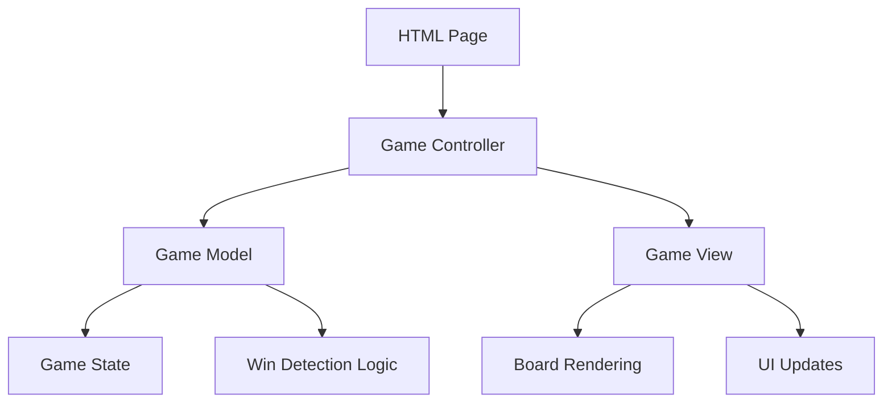

# Tic-Tac-Toe Game Design Document

## Overview

The tic-tac-toe game will be implemented as a web-based application using HTML, CSS, and JavaScript. The design follows a modular approach with clear separation of concerns between game logic, user interface, and state management. The application will be a single-page application that runs entirely in the browser without requiring a backend server.

## Architecture

The application follows a Model-View-Controller (MVC) pattern:

- **Model**: Game state management and business logic
- **View**: DOM manipulation and user interface rendering  
- **Controller**: Event handling and coordination between model and view



## Components and Interfaces

### GameModel Class
Manages the core game state and business logic.

**Properties:**
- `board`: 3x3 array representing the game board state
- `currentPlayer`: String indicating current player ('X' or 'O')
- `gameStatus`: String indicating game state ('playing', 'won', 'draw')
- `winner`: String indicating the winning player (null if no winner)

**Methods:**
- `makeMove(row, col)`: Attempts to place current player's mark
- `checkWinner()`: Evaluates board for winning conditions
- `checkDraw()`: Determines if game is a draw
- `resetGame()`: Resets game to initial state
- `isValidMove(row, col)`: Validates if move is legal

### GameView Class
Handles all DOM manipulation and visual updates.

**Methods:**
- `renderBoard()`: Updates the visual board display
- `updateCurrentPlayer()`: Shows whose turn it is
- `showGameResult(result)`: Displays win/draw message
- `showError(message)`: Displays error messages
- `enableNewGameButton()`: Shows and enables new game button
- `bindCellClickEvents(callback)`: Attaches click handlers to cells

### GameController Class
Coordinates between model and view, handles user interactions.

**Methods:**
- `initGame()`: Initializes new game instance
- `handleCellClick(row, col)`: Processes cell click events
- `handleNewGame()`: Starts a new game
- `updateView()`: Synchronizes view with model state

## Data Models

### Board State
```javascript
// 3x3 array where each cell can be:
// null (empty), 'X' (player X), 'O' (player O)
board = [
  [null, null, null],
  [null, null, null], 
  [null, null, null]
]
```

### Game State Object
```javascript
gameState = {
  board: Array(3x3),
  currentPlayer: 'X' | 'O',
  gameStatus: 'playing' | 'won' | 'draw',
  winner: 'X' | 'O' | null,
  moveCount: number
}
```

## Error Handling

### Input Validation
- Validate cell coordinates are within 0-2 range
- Check if selected cell is empty before allowing move
- Prevent moves when game is already finished

### Error Display
- Show user-friendly error messages for invalid moves
- Clear error messages after successful moves
- Handle edge cases gracefully without crashing

### Error Types
- `INVALID_MOVE`: Attempting to place mark on occupied cell
- `GAME_FINISHED`: Attempting to move when game is over
- `INVALID_COORDINATES`: Cell coordinates out of bounds

## Testing Strategy

### Unit Testing
- Test game logic methods in isolation
- Verify win detection for all possible winning combinations
- Test draw detection with full board scenarios
- Validate move validation logic

### Integration Testing  
- Test complete game flow from start to finish
- Verify UI updates correctly reflect game state changes
- Test new game functionality resets everything properly

### User Acceptance Testing
- Verify all user stories and acceptance criteria are met
- Test game playability with actual user interactions
- Ensure responsive design works on different screen sizes

## User Interface Design

### Layout
- 3x3 grid of clickable cells centered on page
- Current player indicator above the board
- Game result message area below the board
- New game button (shown after game ends)

### Styling
- Clean, modern design with clear visual feedback
- Hover effects on clickable cells
- Distinct colors/styles for X and O marks
- Responsive design for mobile and desktop

### Interactions
- Click cells to place marks
- Visual feedback for valid/invalid moves
- Smooth transitions for state changes
- Keyboard accessibility support

## Implementation Considerations

### Browser Compatibility
- Use vanilla JavaScript (ES6+) for broad compatibility
- Avoid framework dependencies for simplicity
- Ensure CSS works across modern browsers

### Performance
- Lightweight implementation with minimal DOM manipulation
- Efficient win detection algorithm
- No unnecessary re-renders

### Accessibility
- Proper ARIA labels for screen readers
- Keyboard navigation support
- High contrast colors for visibility
- Semantic HTML structure